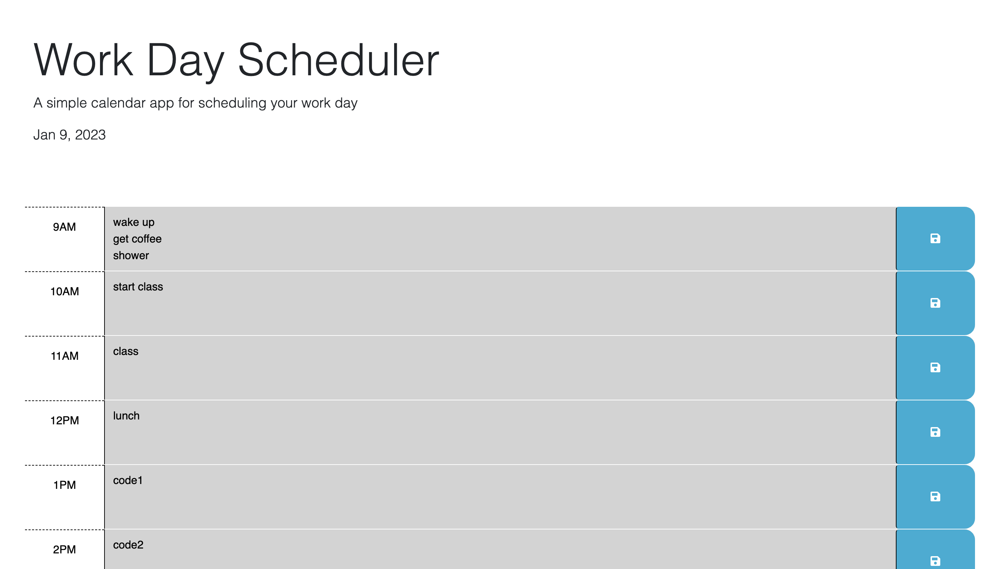

# Work Day Scheduler 

## Description

This web app functions as a simple day planner. The colors of the textboxes dynamically change color depending on the time current time, and the current date is displayed at the top of the page. When the save button is clicked, the contents of each textarea is saved into local storage, and is displayed in the appropriate area upon reloading the page.

## Installation

```sh
git clone git@github.com:jakester101/day-planner.git
```

## Usage

This project deploys as an [HTML website.](https://jakester101.github.io/day-planner)

### Preview


## Credits
[Georgeyoo](https://github.com/Georgeyoo)<br>
[Matt Fyke](https://github.com/mfyke)<br>
[Courtney Mathena](https://github.com/cmathena2u)<br>
[Jacob Hester](https://github.com/jakester101)


---
